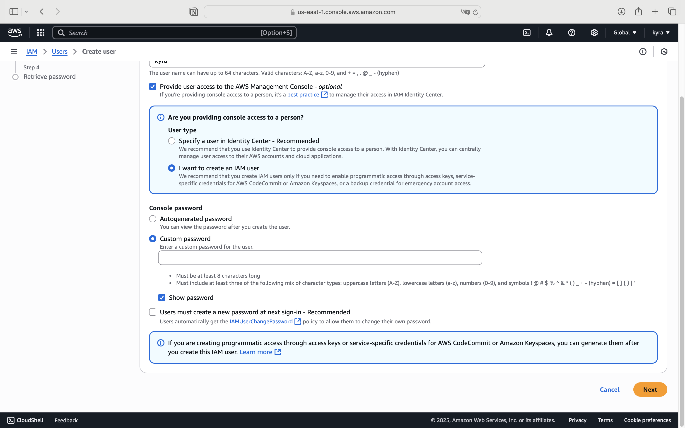

# IAM 사용자 생성 및 로그인 실습 정리


## 루트 계정 vs IAM 사용자

- 현재 사용 중인 계정은 **루트 사용자**입니다.
- 콘솔 상단에서 계정 ID만 표시되면 루트 계정을 사용 중임을 의미합니다.
- **루트 계정은 보안상 최선의 방법이 아니며**, 가능한 한 사용을 자제해야 합니다.

## IAM 사용자 생성

### Specify user details

1. IAM > Users > 사용자 생성
2. 사용자 이름 입력 (예: `kyra`)
3. 접근 방식 선택: **IAM 사용자** 생성  
   > Identity Center (권장)

   > IAM 사용자 방식 (간단)
4. 비밀번호 설정
   - 자신이라면: 사용자 정의 비밀번호 설정
   - 타인이라면: 자동 생성 + 최초 로그인 시 변경 요구

### Set permissions

[[slider]](section4/img/lab/create2.png | section4/img/lab/create3.png | section4/img/lab/create4.png)


1. 사용자 권한 부여
   - 새 그룹 생성: 이름 `admin`
   - 정책 첨부: `AdministratorAccess`
   - 사용자 `kyra`을 그룹에 추가

### Review and create


1. 태그 입력 (선택)

- 예:  
  - Key: `Department`  
  - Value: `Tech`

→ AWS 리소스에 메타데이터로 활용 가능  
→ 강의에서는 데모용으로 한 번만 보여줌

### Retrieve password


 사용자 생성 완료

- CSV로 로그인 정보 다운로드 가능
- 이메일로 전달 가능

---

## 사용자 및 그룹 확인

[[slider]](section4/img/lab/create7.png | section4/img/lab/create8.png | section4/img/lab/create9.png)

- Users 탭에서 `kyra` 확인
- User Groups → `admin` 그룹 확인  
  - 포함된 사용자: `kyra`
  - 부여된 정책: `AdministratorAccess`
- `kyra` 사용자의 권한 → 직접 첨부 아님 → 그룹을 통해 상속됨

---

## IAM 사용자로 로그인하기

[[slider]](section4/img/lab/iam1.png | section4/img/lab/iam2.png | section4/img/lab/iam3.png | section4/img/lab/iam4.png)

1. AWS 계정 대시보드에서 로그인 URL 및 계정 ID 확인
2. **계정 별칭(Alias)** 생성 (예: `abc-def-g`)  
   → 로그인 URL을 더 간단하게 설정 가능
3. 로그인 방법:
   - 같은 브라우저 → 루트와 IAM 계정 충돌 (로그아웃됨)
   - **비공개 모드 브라우저 추천** (Chrome/Firefox/Safari 모두 지원)

---

## 🔁 루트 계정 vs IAM 사용자 동시 로그인

- 왼쪽 창: 루트 사용자 로그인
- 오른쪽 창 (비공개 모드): IAM 사용자 로그인
- 각 창에서 계정 유형 확인 가능:
  - 루트 계정: 상단에 **계정 ID만 표시**
  - IAM 사용자: 상단에 **계정 ID + "IAM 사용자"** 표시됨

---

## 1. 사용자 권한 확인 및 제거

- **Stephane** 사용자는 `admin` 그룹에 속해 있음
- `admin` 그룹은 `AdministratorAccess` 정책을 보유
- 따라서 Stephane은 관리자 권한을 가짐
- **사용자 Stephane으로 로그인 시**
  - IAM 콘솔에서 `Users`에 접근 가능
  - 본인 사용자 정보 확인 가능

---

## 2. 사용자 권한 제거


- `admin` 그룹에서 **Stephane 제거**
- 결과:
  - `Stephane` 사용자에게 권한이 사라짐
  - `IAM:ListUsers` 권한이 없다는 **액세스 거부** 메시지 출력됨
  - IAM 관련 콘솔 접근 불가

---

## 3. 권한 재부여 - IAMReadOnlyAccess

[[slider]](section4/img/lab/make1.png | section4/img/lab/make2.png)

- **직접 정책 첨부**
  - `IAMReadOnlyAccess` 정책 부여
- 결과:
  - 다시 사용자 리스트 등 IAM 리소스 **읽기 권한** 부여됨
  - `ListUsers`, `GetUsers` API 호출 가능

---

## 4. 권한 제한의 효과

- **Group 생성 시도**
  - 권한 부족으로 `Create group` 실패
- 원인:
  - `IAMReadOnlyAccess`는 **읽기 전용 권한**만 제공

---

## 7. 정책 분석 - 예시 1: AdministratorAccess


- JSON 구조:

```json
{
  "Version": "2012-10-17",
  "Statement": [
    {
      "Effect": "Allow",
      "Action": "*",
      "Resource": "*"
    }
  ]
}
```

### ✅ 의미 (ReadOnly 정책)
- `ListUsers`, `ListGroups`, `GetUser`, `GetGroup` 등 **읽기 관련 API 호출 허용**
- **쓰기 권한 (예: Create, Delete 등)** 은 허용되지 않음

---

### 9. 사용자 지정 정책 생성

#### 생성 방법 두 가지:
1. **Visual Editor** 사용
2. **JSON 직접 편집**

#### 🎯 예시: `ListUsers`, `GetUser` 권한만 허용
- Access level:
  - `List`: 1개 선택
  - `Read`: 1개 선택
- Resource: `All`
- 정책 이름: `MyIAMPermissions`

#### 생성된 정책(JSON):
```json
{
  "Version": "2012-10-17",
  "Statement": [
    {
      "Sid": "VisualEditor0",
      "Effect": "Allow",
      "Action": [
        "iam:ListUsers",
        "iam:GetUser"
      ],
      "Resource": "*"
    }
  ]
}
```

10. 정책 첨부 및 권한 검증
MyIAMPermissions 정책을 사용자 또는 그룹에 직접 첨부 가능
정책이 허용한 특정 액션만 수행 가능함을 확인