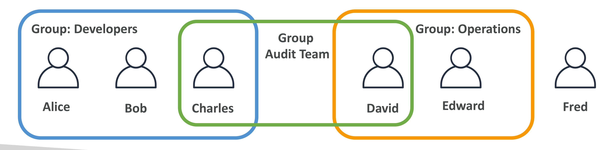

# Section 4 - IAM 및 AWS CLI

## ☁️ 관련 AWS 서비스

| 서비스 | 목적 | 주요 특징 |
|--------|------|-----------|
| 🌐 IAM    | 사용자/권한 관리 서비스 | 글로벌 서비스 (모든 리전에서 동일하게 동작) |

---

**IAM = Identity and Access Management**

AWS에서 사용자, 그룹, 권한(정책)을 관리하는 서비스

---

## 루트 사용자 (Root User)

- AWS 계정 가입 시 자동 생성되는 **최상위 권한 사용자** (공유X)
- IAM 사용자 생성 등 **초기 설정에만 1회 사용**하고 이후에는 **IAM 사용자로만 작업**
- 루트 사용자 대신 IAM 사용자를 만들어 필요한 권한을 위임하여 사용

<details>
<summary> 루트 사용자 vs IAM 사용자 </summary>

<br>

> 루트 사용자 = 피자 가게 사장님

> IAM 사용자 = 알바생

- 사장님은 가게(AWS)를 처음 열고 초기 설정을 함  
  → 직원 뽑기(IAM 사용자 생성), 은행 등록, 메뉴 구성 등  
- 하지만 가게 운영은 매일 사장이 나올 필요 없음
  → 대신 직원들(IAM 사용자)이 일함  
- 직원들이 **무엇을 해야 하는 지 알려주는 업무표(정책)**가 필요함  
  → "주문만 가능", "주방 출입 가능", "POS 결제 가능" 등

### 루트 사용자는 언제만 쓸까?

| 상황 | 사용 여부 |
|------|-----------|
| IAM 사용자 생성 등 초기 설정 | ✅ 사용 |
| 비밀번호 재설정, 결제 정보 변경 등 특수한 작업 | ✅ 사용 |
| 일상적인 리소스 관리/접근 | ❌ IAM 사용자 사용 |

</details>

---

## 사용자와 그룹

> 사용자는 조직 내 개인을 의미

> 그룹은 사용자들의 묶음 (🌟 그룹 ⊄ 그룹, 사용자 ⊂ 그룹)

### 예시



| 그룹명      | 구성원                   |
|-------------|--------------------------|
| Developers  | Alice, Bob, Charles      |
| Operations  | David, Edward            |
| Audit       | Charles, David           |
| (None)      | Fred (그룹 미소속 사용자) |

사용자는 꼭 그룹에 소속될 필요는 없으며, 한 사용자는 여러 그룹에 소속 가능

---

## 권한 (Permission)

### 사용자와 그룹에 권한을 부여하는 이유

- 루트 사용자가 IAM 사용자(User) 또는 그룹(Group)을 생성해도, 기본적으로는 아무 서비스도 사용 못함
- 정책(Policy, JSON 문서)에 사용자의 권한(Permission)을 정의해서 사용자가 특정 서비스에 접근하거나 작업할 수 있도록 함

### 🌟 최소 권한 원칙 (Least Privilege Principle)

사용자에게 꼭 필요한 권한만 부여해야 함

> ✅ 필요한 만큼만 → 안전하고 관리 쉬움

> ❌ 너무 많은 권한 → 비용 폭탄, 보안 사고 발생 가능성

## 정책(Policy)의 구조 (JSON 형식)

```json
{
  "Version": "2012-10-17",
  "Statement": [
    {
      "Effect": "Allow",
      "Action": "ec2:Describe*",
      "Resource": "*"
    },
    {
      "Effect": "Allow",
      "Action": "elasticloadbalancing:Describe*",
      "Resource": "*"
    },
    {
      "Effect": "Allow",
      "Action": [
        "cloudwatch:ListMetrics",
        "cloudwatch:GetMetricStatistics",
        "cloudwatch:Describe*"
      ],
      "Resource": "*"
    }
  ]
}
```

| 필드        | 설명 |
|-------------|------|
| `Version`   | 정책 버전 (`"2012-10-17"` 고정) |
| `Statement` | 실제 권한 정의 블록 (배열: 누가 무엇을 할 수 있는가) |
| `Effect`    | `"Allow"`(권한 허용) 또는 `"Deny"`(권한 거부) |
| `Action`    | 어떤 행동을 허용할까? (`ec2:Describe*`: ec2 정보 보기 허용) |
| `Resource`  | 어떤 대상을 허용할까? (`"*"` = 전체 리소스) |
