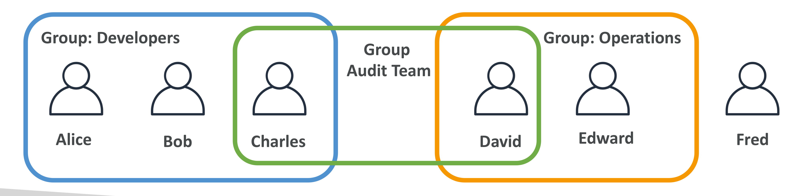
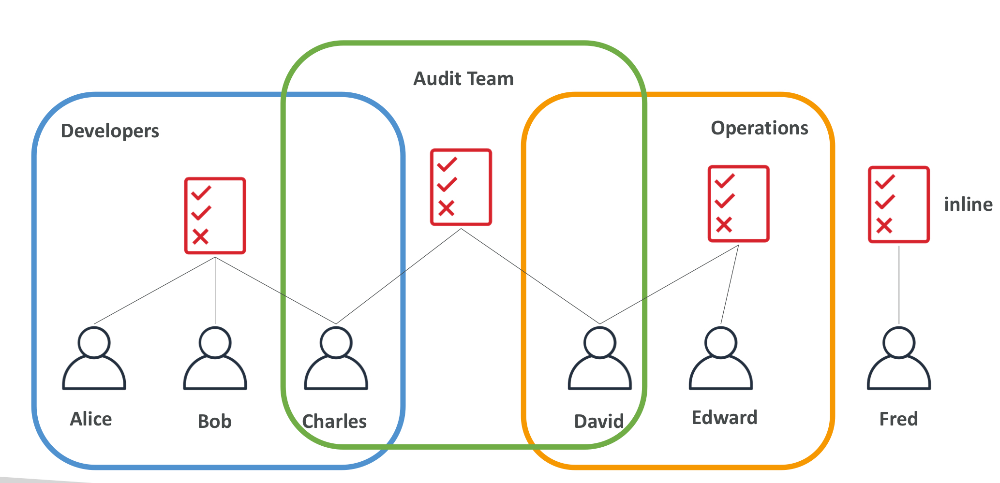
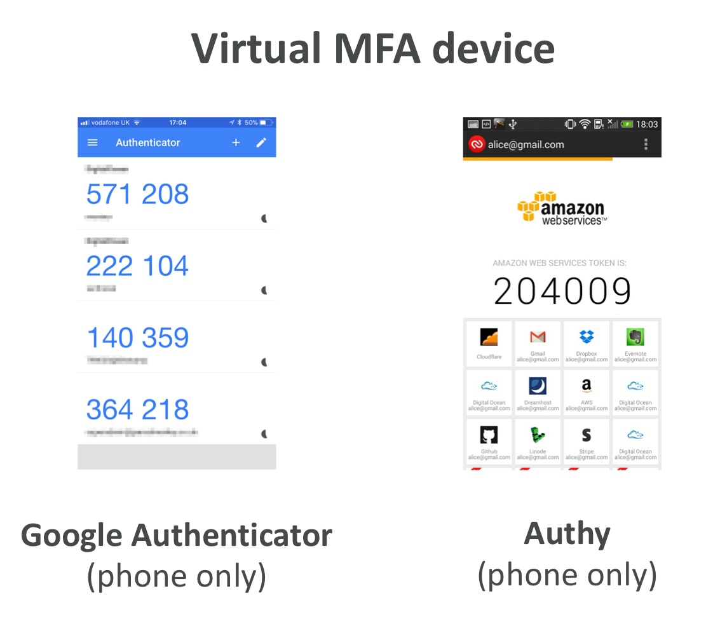
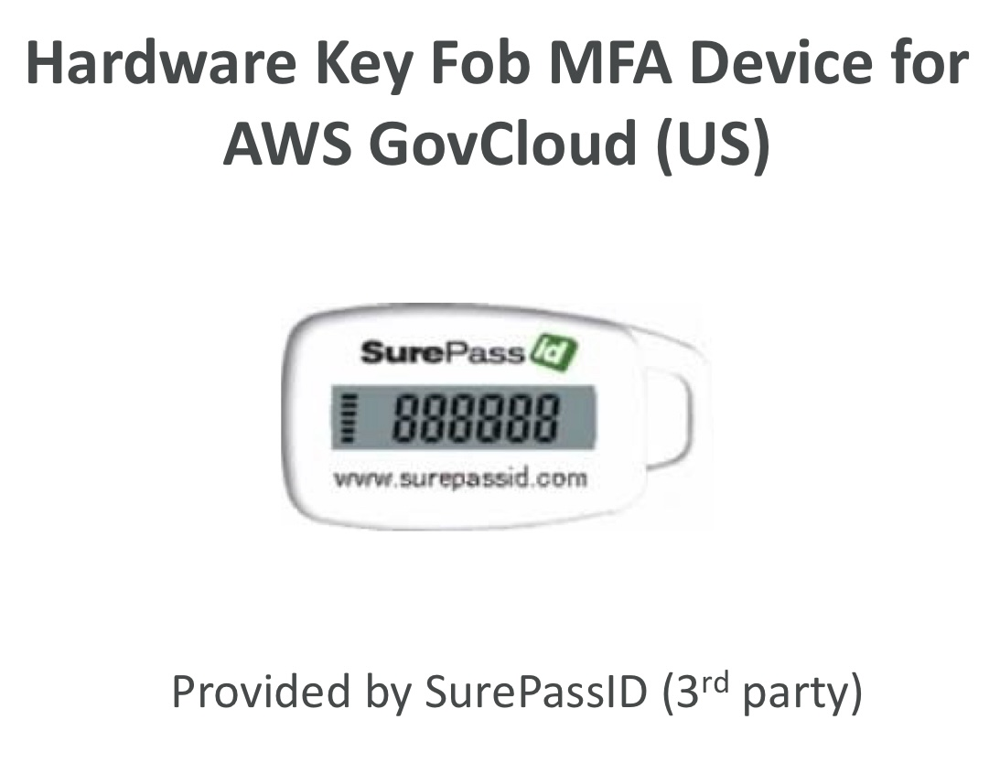
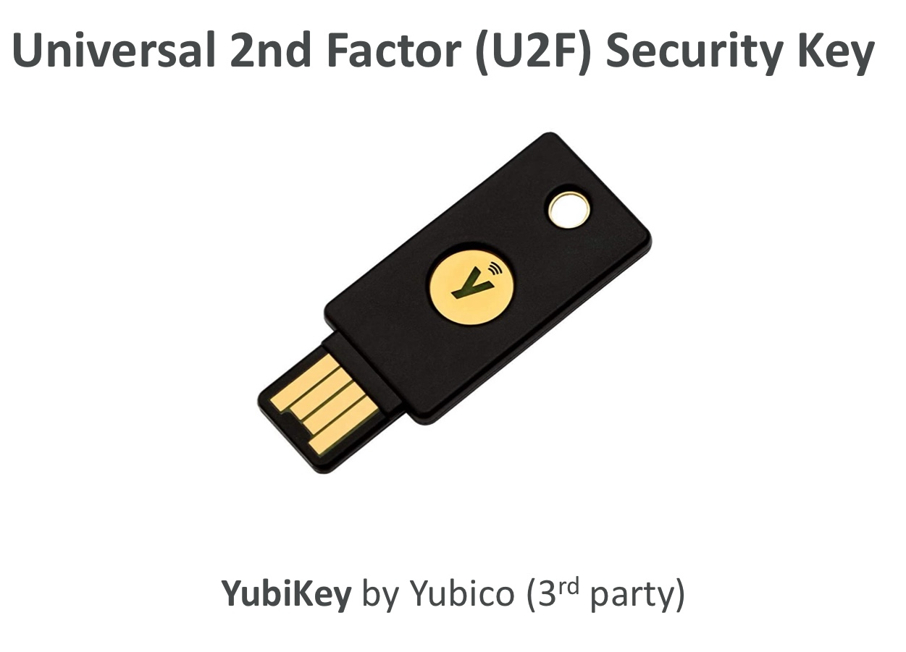

# Section 4 - IAM 개념과 MFA 설정

## ☁️ 관련 AWS 서비스

| 서비스 | 목적 | 주요 특징 |
|--------|------|-----------|
| 🌐 IAM    | 사용자/권한 관리 서비스 | 글로벌 서비스 (모든 리전에서 동일하게 동작) |

**IAM = Identity and Access Management**

AWS에서 사용자, 그룹, 권한(정책)을 관리하는 서비스


<br><br>

## 사용자 (User)

### 루트 사용자 (Root User)
- AWS 계정 가입 시 자동 생성되는 **최상위 권한 사용자** (공유X)
- IAM 사용자 생성 등 **초기 설정에만 1회 사용**하고 이후에는 **IAM 사용자로만 작업**
- 루트 사용자 대신 IAM 사용자를 만들어 필요한 권한을 위임하여 사용

<details>
<summary> 루트 사용자 vs IAM 사용자 </summary>

<br>

> 루트 사용자 = 피자 가게 사장님

> IAM 사용자 = 알바생

- 사장님은 가게(AWS)를 처음 열고 초기 설정을 함  
  → 직원 뽑기(IAM 사용자 생성), 은행 등록, 메뉴 구성 등  
- 하지만 가게 운영은 매일 사장이 나올 필요 없음
  → 대신 직원들(IAM 사용자)이 일함  
- 직원들이 **무엇을 해야 하는 지 알려주는 업무표(정책)**가 필요함  
  → "주문만 가능", "주방 출입 가능", "POS 결제 가능" 등

### 루트 사용자는 언제만 쓸까?

| 상황 | 사용 여부 |
|------|-----------|
| IAM 사용자 생성 등 초기 설정 | ✅ 사용 |
| 비밀번호 재설정, 결제 정보 변경 등 특수한 작업 | ✅ 사용 |
| 일상적인 리소스 관리/접근 | ❌ IAM 사용자 사용 |

</details>

<br><br>

## 그룹 (Group)

> 사용자는 조직 내 개인을 의미

> 그룹은 사용자들의 묶음 (🌟 그룹 ⊄ 그룹, 사용자 ⊂ 그룹)



| 그룹명      | 구성원                   |
|-------------|--------------------------|
| Developers  | Alice, Bob, Charles      |
| Operations  | David, Edward            |
| Audit       | Charles, David           |
| (None)      | Fred (그룹 미소속 사용자) |

> 사용자는 꼭 그룹에 소속될 필요는 없으며, 한 사용자는 여러 그룹에 소속 가능

<br><br>

## 정책(Policy)

```text
[ Policy (정책) ]
       ↓ 적용
 IAM 사용자 / 그룹 / 역할
       ↓ 결과
[ Permission (실제로 가진 권한) ]
```

### 🌟 정책(Policy)의 구조 (JSON 형식)

```json
{
  "Version": "2012-10-17",
  "Id": "S3-Account-Permissions",
  "Statement": [
    {
      "Sid": "1",
      "Effect": "Allow",
      "Principal": {
        "AWS": ["arn:aws:iam::123456789012:root"]
      },
      "Action": [
        "s3:GetObject",
        "s3:PutObject"
      ],
      "Resource": ["arn:aws:s3:::mybucket/*"]
    }
  ]
}
```

### 🌟 정책의 최상위 구성 요소

| 필드      | 설명 |
|-----------|------|
| `Version` | 정책 버전 (`"2012-10-17"` 고정) |
| `Id` (선택)      | 정책 ID |
| `Statement` | "이런 권한을 줄 거야"라는 계획  |

---

### 🌟 Statement의 내부 구성 요소

각 `Statement` 블록은 **누가 무엇을 어디서 어떻게 할 수 있는지**를 정의

| 필드        | 설명 |
|-------------|------|
| `Sid` (선택)      | Statement ID |
| `Effect`    | 이 액션을 허용할까(`Allow`) 거부할까(`Deny`) |
| `Principal` | 누구에게 이 정책을 적용할까 (사람, 역할, 서비스 등)<br>※ 주로 **신뢰 정책(Trust Policy)**에서 사용됨 |
| `Action`    | 무엇을 하게 할까 (예: 파일 읽기, 서버 시작 등) |
| `Resource`  | 어디에서 그 행동을 할 수 있는가 |
| `Condition` | 언제 또는 어떤 조건일 때만 적용할까 |

---

### IAM 정책의 3가지 종류

| 정책 종류 | 설명 | 재사용 가능 | 연결 가능한 대상 |
|-----------|------|---------------|-------------------|
| **AWS 관리형 정책**<br>(AWS Managed Policy) | AWS에서 제공하는 표준 정책 | ✅ 예 | 사용자, 그룹, 역할 |
| **고객 관리형 정책**<br>(Customer Managed Policy) | 사용자가 직접 만든 재사용 정책 | ✅ 예 | 사용자, 그룹, 역할 |
| **인라인 정책**<br>(Inline Policy) | 특정 대상에만 맞춤 설정된 정책 | ❌ 아니요 | 사용자, 그룹, 역할 (각 1:1 전용) |

> 관리형 정책 = AWS 관리형 + 고객 관리형

---
<details>
<summary> 관리형 정책 vs 인라인 정책 비교 </summary>


| 항목 | 관리형 정책 | 인라인 정책 |
|------|--------------|---------------|
| 저장 위치 | 별도로 존재 (중앙 저장소 느낌) | 사용자/그룹/역할 객체 내부 |
| 재사용 가능성 | ✅ 여러 대상에 연결 가능 | ❌ 오직 하나에만 부착 |
| 관리 용이성 | 중앙에서 버전 관리, 수정 용이 | 수동으로 일일이 관리해야 함 |
| 삭제 영향 | 연결만 끊으면 정책은 유지됨 | 사용자/그룹/역할 삭제 시 함께 사라짐 |

</details>

## IAM 정책 상속
사용자는 여러 그룹에 속할 수 있으며, 정책은 그룹 또는 사용자 단위로 연결가능



| 그룹명      | 구성원                         |
|-------------|-------------------------------|
| Developers  | Alice, Bob, Charles           |
| Operators   | David, Edward                 |
| Audit       | Charles, David                |
| (None)      | Fred (그룹 미소속 사용자)     |

- 사용자는 꼭 그룹에 속할 필요 없음
- 한 사용자는 여러 그룹에 속할 수 있음
- 정책은 그룹에 연결될 수도 있고 사용자에게 직접 연결될 수도 있음
---


### 사용자에게 정책을 적용하는 3가지 방법

| 방법 | 설명 | 예시 |
|------|------|------|
| ① 그룹에 정책 연결 | 그룹에 관리형 정책 또는 인라인 정책 연결 | Developers 그룹에 `S3ReadOnlyAccess` 연결 |
| ② 사용자에게 관리형 정책 직접 연결 | 사용자에게 직접 재사용 정책 부여 | Alice에게 `S3FullAccess` 연결 |
| ③ 사용자에게 인라인 정책 부여 | 사용자 전용 정책 직접 작성 | Bob 사용자 안에 `EC2:StartInstances` 작성 |

```text
🌟 정책 구조와 권한 적용의 관계

IAM 정책은 JSON 구조로 작성되며,  
이 정책이 실제 사용자 또는 그룹에 연결될 때 → 권한(permission)으로 변환

> 정책(Policy)은 설계도
> 권한(Permission)은 설계도에 따라 생성된 결과물
```

<br><br>

## 권한 (Permission)

### 사용자와 그룹에 권한을 부여하는 이유

- 루트 사용자가 IAM 사용자(User) 또는 그룹(Group)을 생성해도, 기본적으로는 아무 서비스도 사용 못함
- 정책(Policy, JSON 문서)에 사용자의 권한(Permission)을 정의해서 사용자가 특정 서비스에 접근하거나 작업할 수 있도록 해야함

### 🌟 최소 권한 원칙 (Least Privilege Principle)

사용자에게 꼭 필요한 권한만 부여해야 함

> ✅ 필요한 만큼만 → 안전하고 관리 쉬움

> ❌ 너무 많은 권한 → 비용 폭탄, 보안 사고 발생 가능성

### 권한(Permission)의 구조 (JSON 형식)

```json
{
  "Version": "2012-10-17",
  "Statement": [
    {
      "Effect": "Allow",
      "Action": "ec2:Describe*",
      "Resource": "*"
    },
    {
      "Effect": "Allow",
      "Action": "elasticloadbalancing:Describe*",
      "Resource": "*"
    },
    {
      "Effect": "Allow",
      "Action": [
        "cloudwatch:ListMetrics",
        "cloudwatch:GetMetricStatistics",
        "cloudwatch:Describe*"
      ],
      "Resource": "*"
    }
  ]
}
```

| 필드        | 설명 |
|-------------|------|
| `Version`   | 권한 버전 (`"2012-10-17"` 고정) |
| `Statement` | 권한을 정의하는 규칙들의 묶음 |
| `Effect`    | 이 권한을 허용할지(Allow) 또는 막을지(Deny) 정함 |
| `Action`    | 무엇을 하게 할까 |
| `Resource`  | 어디에서 그 행동을 할 수 있는가 (`"*"` = 전체 리소스) |


### 권한 적용 원칙 (병합과 상속)
> 여러 정책이 적용된 후 → 실제 어떤 권한이 발생하는가?
- 사용자에게 적용되는 최종 권한 =  `그룹 정책` + `관리형 정책 직접 연결` + `인라인 정책`

- 단, **명시적 Deny**가 있을 경우 → **무조건 거부**

<details>
<summary> 명시적 Deny란? </summary>

> 어떤 정책에서 Effect: "Deny"로 명시되면,  
> 다른 정책에서 아무리 Allow해도 → **그 요청은 무조건 거부됨**

### Allow vs Deny 우선순위

| 상황                                |  결과                                |
|-------------------------------------|-------------------------------------|
| 정책 A가 Allow, 정책 B가 Deny       | ❌ Deny 적용됨 (거부가 항상 우선)    |
| 정책 A가 Allow, 정책 B 없음         | ✅ Allow                             |
| 정책 A가 없음, 정책 B가 Deny        | ❌ Deny                              |

</details>

<br>

```json
예: 정책 문서 (Policy)
{
  "Effect": "Allow",
  "Action": "ec2:Describe*",
  "Resource": "*"
}

→ 이 정책을 Alice에게 연결했을 때

Permission: Alice는 EC2 인스턴스를 조회할 수 있음
```
<br><br>

## IAM 사용자(그룹) 보호 정책 2가지

### 1️⃣ 비밀번호 정책 (Password Policy)

비밀번호 정책은 IAM 사용자 계정의 보안을 강화하기 위해 **비밀번호 기준**을 설정합니다.

#### 주요 설정 항목

- **최소 비밀번호 길이** 지정 가능
- **문자 유형 요구**
  - 대문자 (A-Z)
  - 소문자 (a-z)
  - 숫자 (0-9)
  - 특수문자 (!, ?, @ 등)
- **비밀번호 변경 허용 여부** 설정 가능
- **비밀번호 만료 기간** 설정 가능 (예: 90일마다 변경 요구)
- **이전 비밀번호 재사용 금지** 설정 가능


### 🌟 2️⃣ MFA (Multi-Factor Authentication) 다중 인증

비밀번호 외에 **추가적인 보안 요소**를 사용해 사용자 인증을 강화하는 방법

> MFA = "비밀번호 + 내가 가진 장치"의 조합으로 로그인하는 방식


<details>
<summary> MFA 로그인 예제 </summary>

> 사용자는 **비밀번호 + MFA 앱의 토큰 코드**를 입력해야 로그인 가능
> 예: Google Authenticator, Microsoft Authenticator 등


#### 예시: 사용자 Alice

- Alice는 **비밀번호 + MFA 코드**를 함께 입력
- 해커가 Alice의 **비밀번호를 알아도**, MFA 장치 없이는 **로그인 불가능**
- MFA 장치는 다음 중 하나일 수 있습니다:
  - 스마트폰 앱 (예: Google Authenticator)
  - 물리 보안키 (예: YubiKey)


| 보안 요소         | 설명                              |
|------------------|-----------------------------------|
| 비밀번호       | 사용자가 아는 정보 (1차 인증 수단) |
| MFA 토큰 코드 | 사용자가 가진 장치에서 생성됨 (2차 인증 수단) |

2단계 인증을 통해 **계정 보안을 강화**

</details>

#### MFA의 필요성
- 루트 사용자 및 중요한 IAM 사용자(예: 관리자)에게 특히 필수
- 비밀번호가 유출되더라도 **실제 장치가 없으면** 로그인 불가

---

### 🌟 AWS에서 지원하는 MFA 장치 유형

| 유형 | 장치 예시 | 설명 |
|------|-----------|------|
| **1. 가상 MFA 디바이스** | | - 스마트폰 앱 기반 MFA<br>- 하나의 기기로 여러 계정 관리 가능<br>- 설치 및 사용이 간편 |
| **2. 하드웨어 MFA 토큰** | | - 물리 장치로 MFA 코드 생성<br>- 인증 서버와 시간 동기화<br>- 3rd party (Gemalto) |
| **3. GovCloud 전용 MFA** |  | - AWS GovCloud(US) 환경 전용 MFA 장치<br>- 별도 구매 필요<br>- 3rd party (SurePassID) |
| **4. U2F 보안 키** | | - USB 보안 키 기반 물리 장치<br>- 클릭 한 번으로 인증<br>- 강력한 피싱 방지 기능<br>- 하나의 키로 여러 루트 및 IAM 사용자 지원 가능<br>- 3rd party (Yubico) |
