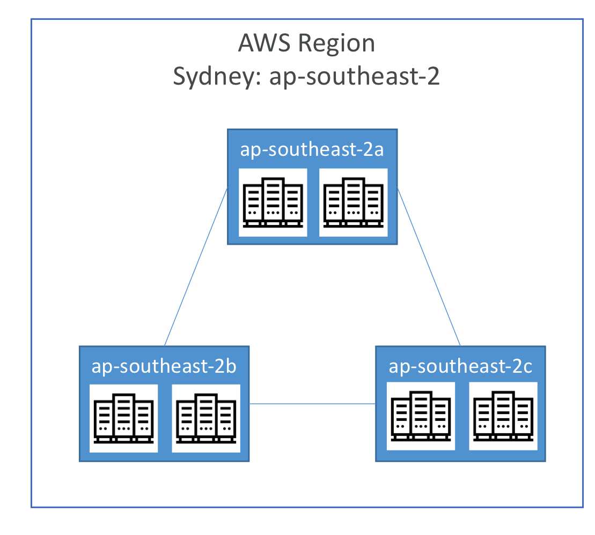

# Section 3 - Getting Started with AWS

## ☁️ Related AWS Services

| Service     | Purpose                         | Key Features |
|-------------|----------------------------------|--------------|
| Region      | A "city-level" area where AWS data centers are located | [Differences by Region and services](https://aws.amazon.com/about-aws/global-infrastructure/regional-product-services/) |

---

## [AWS Global Infrastructure Overview](https://aws.amazon.com/about-aws/global-infrastructure/regions_az/?nc1=h_ls)

AWS operates a **global infrastructure** to ensure **fast and reliable cloud services** for users around the world.

---

## 🌟 Components of AWS Global Infrastructure
Data Center ⊂ AZ (a group of physically separated buildings in a city) ⊂ Region (geographic area)

| Term                 | Description |
|----------------------|-------------|
| **Region**           | A geographic area where AWS operates physical servers |
| **Availability Zone (AZ)** | A group of isolated data centers within a Region (usually 3-6 zones) |
| **Data Center**      | A physical facility where servers are located (multiple per AZ possible) |
| **Edge Location**    | A place to deliver content (images, files, videos) quickly to users |
| **Point of Presence (PoP)** | A broader network access point that includes Edge Locations and more |

 🌟 What is an Edge Location?

 

### Scenario

> Pizza shop headquarters: United States  
> Franchise store = **Edge Location**: South Korea

- Without an Edge Location  
  A user in Korea orders a pizza → Made in the U.S. and shipped via airplane → Long delivery time

- With an Edge Location  
  A user in Korea orders a pizza → Delivered directly from a nearby Seoul franchise (cached content) → Fast delivery

### Application

| Real-world Example      | AWS Concept                  |
|-------------------------|------------------------------|
| U.S. Headquarters       | U.S. Region (origin content server) |
| Seoul Franchise Store   | Edge Location (cache server) |
| Pizza                   | Content (images, videos, CSS, etc.) |
| Delivery                | Content delivery to users (via CDN) |

**CloudFront** is AWS's primary Content Delivery Network (CDN) service.

---

## AWS Region

- A Region consists of multiple Availability Zones (AZs)
- Each Region has a unique identifier (e.g., `us-east-1`, `ap-northeast-2`)
- Most AWS services are configured at the Region level (Region-scoped)  
  → **Services created in Region A are not automatically available in Region B**

### 🌟 4 Key Factors When Choosing a Region

| Factor | Description | Example |
|--------|-------------|---------|
| **Compliance** | Legal restrictions on data location may apply | Data in France must stay in France |
| **Proximity** | Hosting services close to end-users reduces latency | Choose `us-east-1` if most users are in the U.S. |
| **Available Services** | Not all Regions offer all AWS services | Make sure your needed service is available |
| **Pricing** | Pricing can vary by Region | Ohio may be cheaper than Seoul |

---

## Availability Zones (AZ)

- AZs are **isolated infrastructure units** within a Region (typically 3–6)
- Each AZ consists of **one or more independent data centers**, connected via **redundant power, networking, and connectivity**
- AZs are **physically separated** to prevent failure propagation, but are interconnected through **high-bandwidth, low-latency networks**

### Example

- Region: `ap-southeast-2` (Sydney)
- AZs: `ap-southeast-2a`, `2b`, `2c`
- Each AZ may contain 2–3 data centers (exact number not disclosed)
